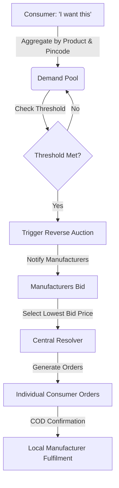

# Demandly — Reverse Buying Platform
> **Consumers Unite, Manufacturers Compete.** 

Demandly is a demand-driven eCommerce platform that flips the traditional supply-driven retail model. Instead of manufacturers listing products and inflating prices to cover marketing costs, consumers aggregate demand locally. Once a threshold is met, manufacturers compete in a reverse auction — lowest bid wins.

---

## ⚙️ How It Works



### Key Mechanics
- **Demand Aggregation** — Consumers specify product, quantity, price limit, and pincode. Demand is auto-clustered.
- **Reverse Auction** — Verified manufacturers bid competitively. Real-time `leading` / `outbid` feedback.
- **Lowest Price Wins** — Cron-based auto-closure selects the cheapest bidder and generates individual orders.
- **Annual Subscriptions** — Lock in 12-month supply of essentials at bulk prices.

---

## 🛠️ Technology Stack

| Layer | Technology |
|-------|-----------|
| **Backend** | Node.js · Express 5 · TypeScript · Prisma 7 · PostgreSQL · Redis |
| **Frontend** | Next.js 15 · React 19 · TypeScript · Zustand · CSS Modules |
| **Mobile** | Flutter · Dart · Clean Architecture |
| **Auth** | JWT (15-min access + HttpOnly refresh tokens) · Google OAuth |
| **Validation** | Zod schemas on all routes |
| **Infra** | Docker · Nginx · Firebase (push) · AWS S3 · Twilio (SMS) · Razorpay |

---

## 📂 Directory Structure

```
Demandly/
├── backend/                  # REST API Server
│   ├── prisma/               # Database Schema & Migrations
│   ├── src/
│   │   ├── config/           # Env validation (Zod) + frozen config
│   │   ├── middlewares/      # Auth, validation, rate limiter, error handler
│   │   ├── routes/           # API Endpoints (Admin, Consumer, Manufacturer)
│   │   ├── schemas/          # Zod input schemas for all routes
│   │   ├── cron/             # Auto-closure Cron Jobs
│   │   └── utils/            # Logger, Geocoding, Auction Resolver
│   └── tests/                # Automated API & E2E Tests
├── demandly-app/             # Next.js Web App
│   ├── src/
│   │   ├── app/              # App Router Pages & Components
│   │   ├── components/ui/    # Modular Visual Components
│   │   └── stores/           # Zustand Global State
│   └── public/               # Static assets
└── docs/                     # All project documentation
    ├── FINAL_REPORT.md       # Comprehensive project report
    ├── IMPROVEMENTS.md       # 41-item code review findings
    └── EXECUTION_PLAN.md     # 6-week implementation roadmap
```

---

## 🚀 Getting Started

### Prerequisites
- [Node.js](https://nodejs.org/) v18+
- PostgreSQL & Redis instances (local or hosted)

### 1. Backend Setup
```bash
cd backend
cp .env.example .env          # Fill in your values (see docs/FINAL_REPORT.md §9)
npm install
npx prisma migrate dev        # Apply DB migrations
npx prisma db seed            # Seed initial data
npm run dev                   # Starts on PORT (default 5000)
```

### 2. Frontend Setup
```bash
cd demandly-app
cp .env.example .env.local    # Fill in your values
npm install
npm run dev                   # Starts on port 3000
```

---

## 🧪 Testing

```bash
cd backend

# Unit & Integration Tests (41 tests)
npm test

# E2E Lifecycle Tests (45 tests)
npm run test:e2e
```

The E2E suite validates the entire platform lifecycle:  
Registration → Verification → Demand Creation → Bidding → Auction Resolution → Order Fulfilment → Shipping

---

## 🔒 Security Highlights

- **No hardcoded secrets** — All credentials validated at startup via Zod
- **JWT hardening** — 15-minute access tokens + HttpOnly refresh token rotation
- **Input validation** — Zod schemas on every protected route
- **Rate limiting** — Per-route configurable limits
- **Request tracing** — `x-request-id` on every request for debugging
- **Structured error responses** — Consistent `{ error: { code, message, requestId } }` format
- **Graceful shutdown** — Properly closes DB, Redis, and HTTP connections

---

## 📚 Documentation

All project documentation lives in the [`docs/`](./docs) folder:

| Document | Description |
|----------|-------------|
| [FINAL_REPORT.md](./docs/FINAL_REPORT.md) | Complete project report with architecture, features, test results, and configuration reference |
| [IMPROVEMENTS.md](./docs/IMPROVEMENTS.md) | 41-item code review — categorized by severity (Critical → Low) |
| [EXECUTION_PLAN.md](./docs/EXECUTION_PLAN.md) | 6-week, 96-point implementation roadmap for future development |

---

## 📄 License

ISC
